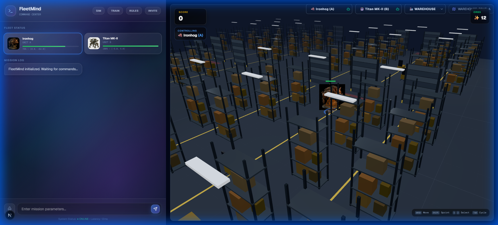
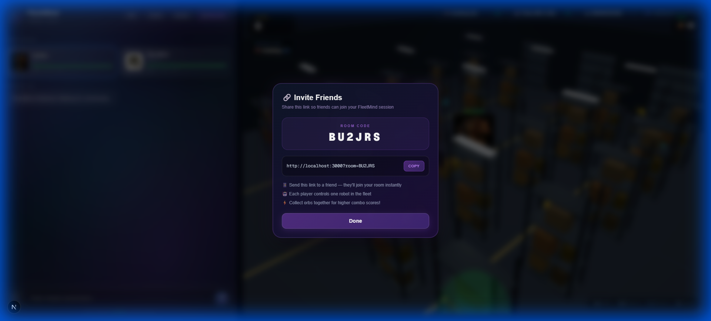
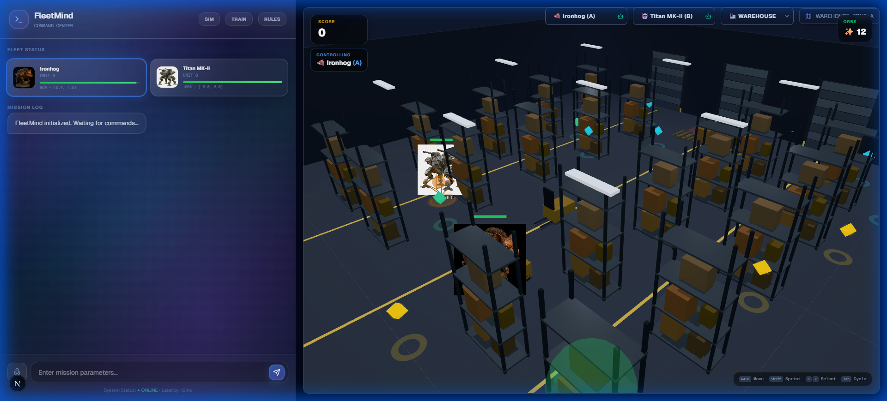

# FleetMind: AI-Powered Robot Fleet Orchestration 🤖

**FleetMind** is a next-gen web-based "Mission Control" for operating robot fleets. It combines natural language command processing with a high-fidelity 3D simulation, real-time multiplayer synchronization, and gamified mechanics.

## 🚀 Key Features

### 🎮 Gamified Simulation
- **Infinite Open World**: Explore a seamless, infinitely tiling warehouse environment (Subway Surfers style).
- **Collectible Orbs**: ⚡ Energy, ⏩ Speed, and 🔧 Repair orbs spawn dynamically. Chain them for combo multipliers!
- **Charging Mechanics**: Monitor battery levels and return to the glowing green charging station at `[10, 0, 10]`.
- **Sprint System**: Hold `Shift` for a speed boost (at the cost of higher battery drain).

### 🌐 Multiplayer & Social
- **Real-Time Sync**: Play with friends! Room-based state synchronization ensures everyone sees the same robot movements.
- **Invite System**: Generate unique invite links (`?room=CODE`) to jump into shared sessions instantly.

### 🧠 AI & Control
- **Natural Language**: "Inspect the north sector" -> Converted to coordinate missions via Gemini 2.0.
- **Hybrid Intelligence**: LLM high-level planning + Q-Learning obstacle avoidance.
- **Glassmorphism HUD**: Premium UI overlay for real-time telemetry and control.

## 📸 Gallery

### Infinite Warehouse & Gameplay


### Multiplayer Invite System


### HUD & Mechanics


## 🛠️ Tech Stack

-   **Frontend**: Next.js 14, React, Tailwind CSS
-   **3D Engine**: React Three Fiber (R3F), Drei
-   **Backend**: Next.js API Routes + Upstash Redis (State)
-   **AI**: Google Gemini 2.0 Flash (Reasoning), Custom Q-Learning Agent (Pathing)

## 🏁 Getting Started

1.  **Clone the repo**:
    ```bash
    git clone https://github.com/shingloo55/FleetMind.git
    cd FleetMind
    ```
2.  **Install dependencies**:
    ```bash
    npm install
    ```
3.  **Configure Environment**:
    Create `.env.local` and add:
    ```env
    NEXT_PUBLIC_GEMINI_API_KEY=your_key_here
    UPSTASH_REDIS_REST_URL=your_redis_url
    UPSTASH_REDIS_REST_TOKEN=your_redis_token
    ```
4.  **Run Development Server**:
    ```bash
    npm run dev
    ```
    Open [http://localhost:3000](http://localhost:3000).

---

**Developed by Hemal Shingloo**
Reach out at: [shingloo55@gmail.com](mailto:shingloo55@gmail.com)
